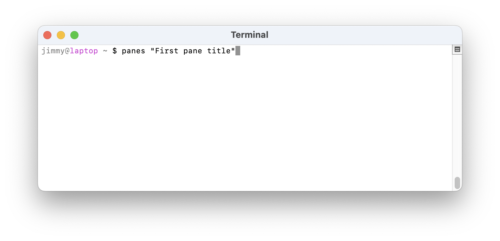
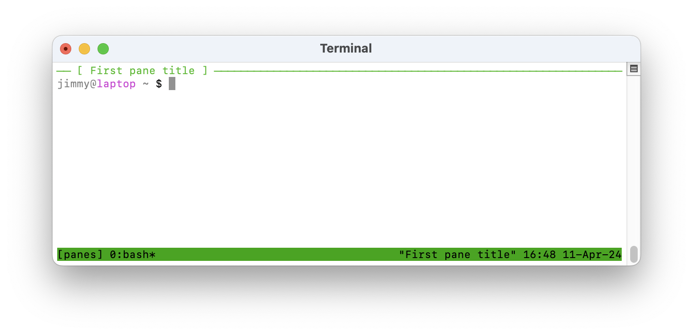
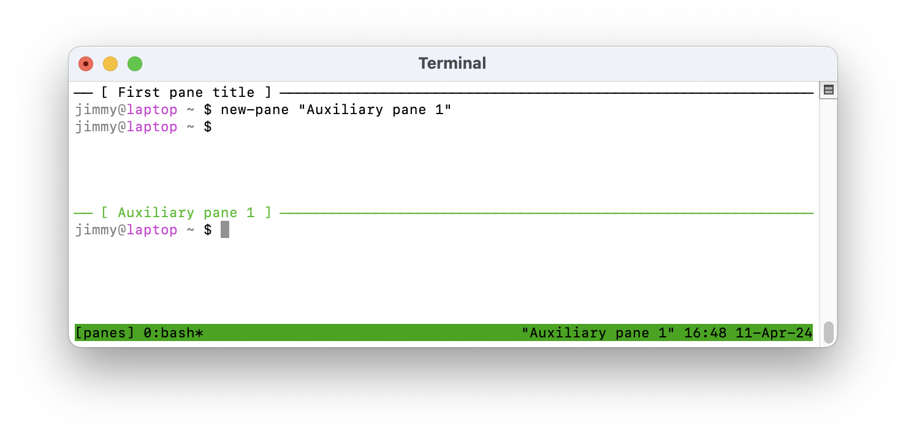

# Multiple panes in the terminal

You only have to remember two commands:

1. `panes "Optional title"`
2. `new-pane "Optional title"`

This is a thin wrapper around [tmux](https://github.com/tmux/tmux/wiki) to support multiple panes in the terminal window.

**Setup**. Copy the source file [`panes`](https://github.com/jimmymathews/panes/blob/main/panes) to a location somewhere on your path and make it executable. The file name is up to you.

Then (if you called it `panes`):
```sh
panes install
```

Use `panes --help` or `panes help` to see usage examples.







